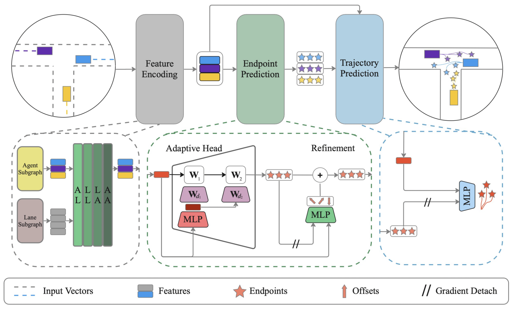

# ADAPT: Efficient Multi-Agent Trajectory Prediction with Adaptation
### [Paper](https://arxiv.org/abs/2307.14187) | [Webpage](https://kuis-ai.github.io/adapt)
This is the official implementation of the paper *ADAPT: Efficient Multi-Agent Trajectory Prediction with Adaptation* published in ICCV 2023.



## Introduction
1\. Clone this repository:
```
clone https://github.com/gorkaydemir/ADAPT.git
cd ADAPT
```

2\. Create a conda environment and install required packages:
```
conda create -n adapt python=3.8
conda activate adapt
conda install pytorch==1.12.1 torchvision==0.13.1 torchaudio==0.12.1 cudatoolkit=11.3 -c pytorch
```

3\. Apply preprocessing to data and extract them into /path/to/data, following the process explained in dataset/README.md


## Train
```
python run.py \
--ex_file_path /path/to/data/extended_ex_list \
--val_ex_file_path /path/to/data/eval.ex_list \
--model_save_path checkpoints/exp0 \
--static_agent_drop --scaling
```

## Validation
```
python run.py --validate \
--ex_file_path /path/to/data/extended_ex_list \
--val_ex_file_path /path/to/data/eval.ex_list \
--model_save_path checkpoints/exp0 \
--checkpoint_path /path/to/checkpoint --use_checkpoint 
```
You can download the pretrained model [here]([[https://github.com/gorkaydemir/ADAPT/releases/download/1.0/checkpoint.pt](https://github.com/gorkaydemir/ADAPT/releases/tag/checkpoint)]).

## How to Cite
```bibtex
@InProceedings{Aydemir2023ICCV,
        author = {Aydemir, G\"orkay and Akan, Adil Kaan and G\"uney, Fatma},
        title = {{ADAPT}: Efficient Multi-Agent Trajectory Prediction with Adaptation},
        booktitle = {Proceedings of the IEEE/CVF International Conference on Computer Vision},
        year      = {2023}}
```
